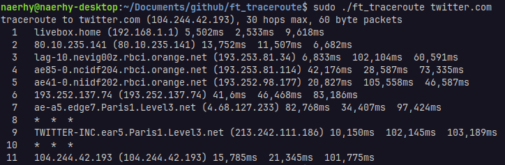

# ft_traceroute

Custom implementation of traceroute command.

## Description

ft_traceroute is a network project written in C whose goal is to write a custom implementation of the existing command of the same name (`man traceroute`). This program is used to determine the route between two connections. It will print the names or IP addresses of all the routers between two devices.

The program sends UDP packets and modifies the time-to-live (TTL) value inside IP headers to determine the intermediate routers being traversed towards the destination. Why? Because routers decrement TTL values of packets by one when routing and discard those whose have reached a value of zero. By analyzing the ICMP messages, with the help of a raw socket, returned by these routers along the route, we can check if the packet has reached its destination.

ft_traceroute can be divided into several stages:
1. parses options and destination
2. initializes UDP and raw sockets
3. starts the main loop:
	1. sets initial TTL value to 1
	2. sends 3 UDP packets
	3. waits a maximum of 3 seconds for each ICMP response, validates and prints the result
	4. increments TTL and repeats until a `Destination Unreachable` ICMP message has been received or max TTL has been reached
4. exits and releases resources

As requested by the subject, the program only manages IPv4 addresses and hostnames.  
The usage of a raw socket requires the executable to be run with sudo privileges.

### Bonus

- DNS management
- handle `-f` `-m` `-p` `-q` `-t` `-w` options

## Usage

```bash
# build the program
make

# run the executable
sudo ./ft_traceroute [options] (destination)

# display help
./ft_traceroute -?
```

## Screenshots


